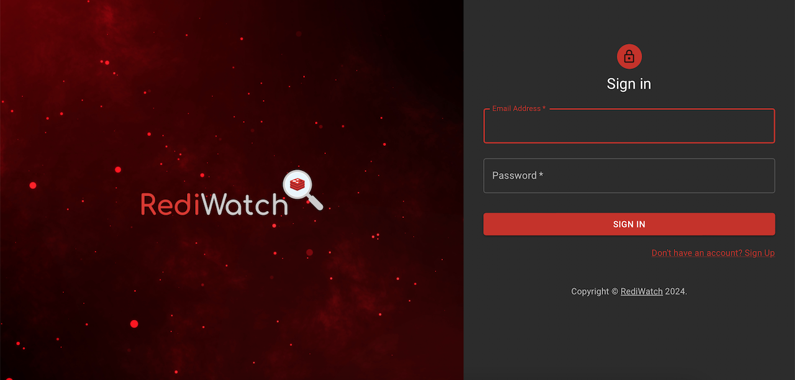
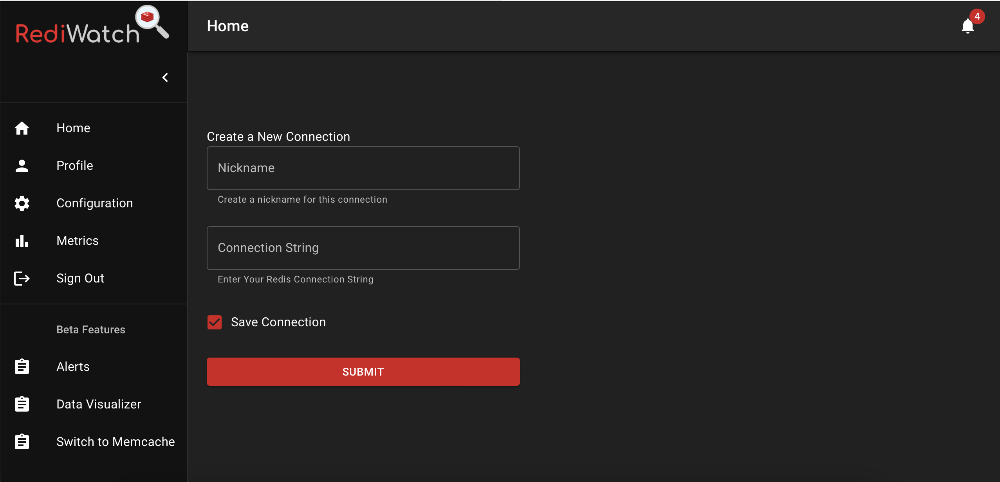
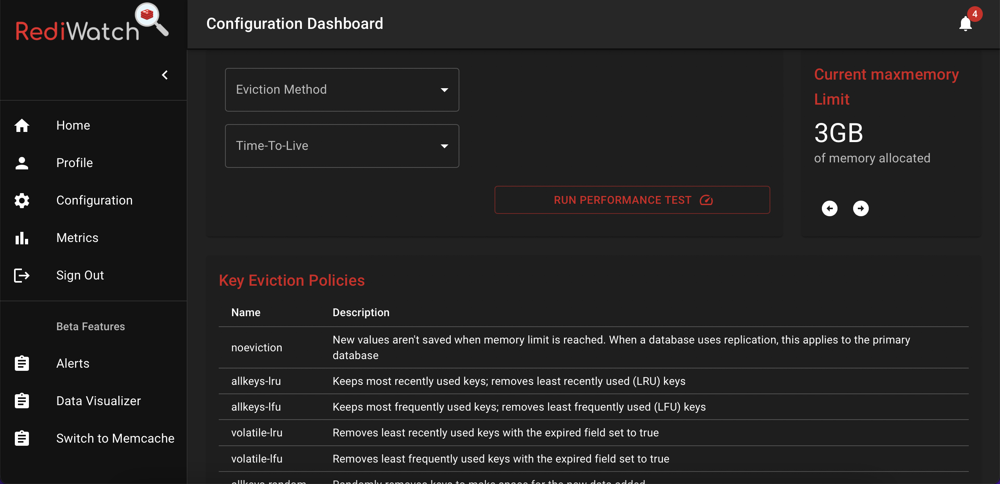

# RediWatch

*Website and Dev-tool: [Rediwatch](https://github.com/oslabs-beta/RediWatch)*

## Overview

Caching provides significant performance optimization for any application, however it is difficult to confirm the efficiency of your cache. As applications grow and scale, managing a Redis cache becomes increasingly complex. Redis, a popular in-memory data store, is essential for optimizing application performance by reducing database load and ensuring quick data retrieval. However, gaining clear visibility into how well your Redis cache performs and finding the best configuration is a significant challenge. Without proper insights, you risk inefficient memory usage, low cache hit rates, and suboptimal configurations that can degrade your application's performance.

Rediwatch is an open-source tool designed to help developers and engineers visualize and optimize their Redis cache by displaying vital metrics for application caches through an intuitive, user-friendly website. Rediwatch is easy to utilize, free to use, and assists developers in visualizing cache performance issues, so that they can avoid constantly monitoring their applications caches. As users select different cache configurations and invalidation methods, metrics will be updated and visualized on the dashboard. With RediWatch, users can enter their Redis connection string to instantly access comprehensive insights into their cache's performance. The app provides visualizations for hit rates, memory allocation, and key performance indicators, allowing users to fine-tune their caching strategies.

Additionally, RediWatch features a configuration testing environment where users can experiment with different Redis setups without impacting their live cache. The app’s data mocking functionality ensures that tests are safe, preserving the stability of the production environment while allowing for thorough exploration and optimization of Redis configurations. Rediwatch monitors:

- Used memory
- Key space hits and misses
- Commands processed
- Connected clients
- Evicted and expired keys
- *and many more*

## Core Features

- Customizable Metrics: Customize which metrics you want to have displayed in real-time.
- Login: Create an authorized profile to quickly and securely access Rediwatch and save your Redis caches.
- Easy Set Up: Simply enter your Redis connection URL, give it a nickname, and click to connect.
- Data Cloning: Rediwatch clones user's caches to provide safe and controlled testing without risking the stability of the production environment.
- Free: Rediwatch offers cache visualization for free, making it accessible to all developers.

## Getting Started

### How do you use Rediwatch for applications in production?
Navigate to [Rediwatch](https://github.com/oslabs-beta/RediWatch) and set up a user account. *Only users with an account can use Rediwatch at this time.*

Go to your Redis cloud console and copy your Redis connection URL from your configuration settings. *Your connection url should include your host, port, and password for Redis.*
Add your Redis connection URL on the homepage, and give it a unique nickname before you add it to your profile. Click submit to generate testing on this cache to display your metrics.

Rediwatch will generate the graphs for the performance metrics associated with the selected cache, and you can interact with our dynamic graphs by selecting different eviction policies, ttl times, and maxmemory setting on the Configuration page.
Select the cache configuration settings you would like to visualize, then click the run tests button to update the metrics graphs with the latest cache configuration.



### How do you use Rediwatch for applications in development?

There are two ways to use the application for development purposes. The first method:

1. First, clone the repository from Github .
2. Run ```docker build -t rediwatch -f Dockerfile-dev .``` in your terminal
3. Run ```docker-compose -f docker-compose-dev-hot.yml up``` in your terminal
4. Navigate to [localhost:8080](https://localhost:8080). You should see the web application and enter your Redis connection URL (default is empty) and nickname.

Or, simply pull the image from Docker:

1. Navigate to [Docker Hub](https://hub.docker.com) and pull the image using the command ```docker pull rediwatch/rediwatch```
2. Run ```npm run docker-dev:hot``` in your terminal
3. Navigate to [localhost:8080](https://localhost:8080). You should see the web application and enter your Redis connection URL (default is empty) and nickname.

*If you're having any trouble, please refer to the images in the section above.*

## Tech Stack

Node.js | Typescript | React.js | PostgreSQL | Redis | Grafana | Express | Material UI | Docker

## Technical Challenges

- **Chart Visualization Overengineering:**

Initially, we attempted to integrate Prometheus with Grafana for chart visualization, expecting this combination to handle our data needs effectively. However, the complexity of setting up and managing Prometheus introduced unnecessary overhead. We realized that for our use case, directly sending data from Redis to Grafana would simplify our architecture without sacrificing functionality. This change reduced complexity and improved our ability to focus on delivering a more intuitive user experience.

- **Data Cloning for Safe Testing:**

One significant challenge was ensuring that our configuration testing feature could run without affecting the live Redis cache. Cloning live data in a safe and controlled way was critical. To achieve this, we developed a robust data mocking system that simulates Redis data. This approach allowed us to provide realistic testing scenarios without risking the stability of the production environment, giving users confidence to experiment and optimize configurations safely.

- **Containerization for Consistent Deployment:**

To ensure consistent deployment across different environments, we containerized our app using Docker. This involved creating separate Docker images for the frontend, backend, Redis, Grafana, and PostgreSQL. While this approach offered the benefits of isolation and consistency, it also introduced complexities in managing inter-service communication and maintaining performance parity with non-containerized environments. We overcame these challenges by fine-tuning our Docker Compose setup and optimizing network configurations, ensuring that all services communicated seamlessly and that performance metrics remained accurate and reliable across all environments.

## How to Contribute

1. Clone the repo and make a new branch
2. Run ```docker build -t rediwatch -f Dockerfile-dev .``` in your terminal
3. Run ```npm run docker-dev:hot``` in your terminal
4. Add a feature, fix a bug, or refactor some code
5. Write tests for the changes you made, if necessary
6. Run unit tests and make sure all tests pass: npm test
7. Open a Pull Request with a comprehensive description of changes to the dev branch

## Future Features
There are plenty of features that still need to be integrated into the codebase:
- Jest testing: Adding more unit tests and end-to-end tests for application performance reliability.
- Alerts and notifications: Set up alerts for individual metrics to be notified when a metric dips below or exceeds a specified value.
- AuthO: Integrating Google or Github login to quickly and securely access Rediwatch.

## Contributors

**Yang Cao** [Github](https://github.com/Oliviak109382) | [LinkedIn](https://linkedin.com)

**Ansel Nolting** [Github](https://github.com/AnselNolting) | [LinkedIn](https://linkedin.com)

**Jennifer Slaughter** [Github](https://github.com/j-slaughter) | [LinkedIn](https://linkedin.com)

**YoonJoo Woo** [Github](https://github.com/YoonJooWoo) | [LinkedIn](https://linkedin.com)
